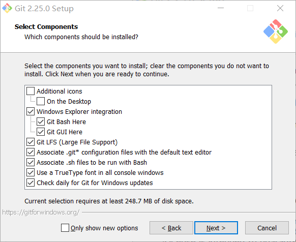
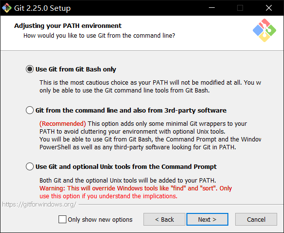
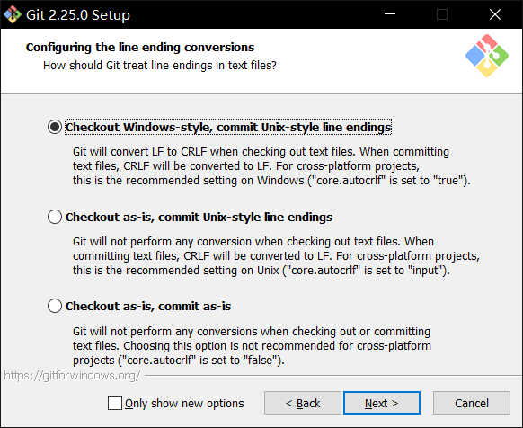
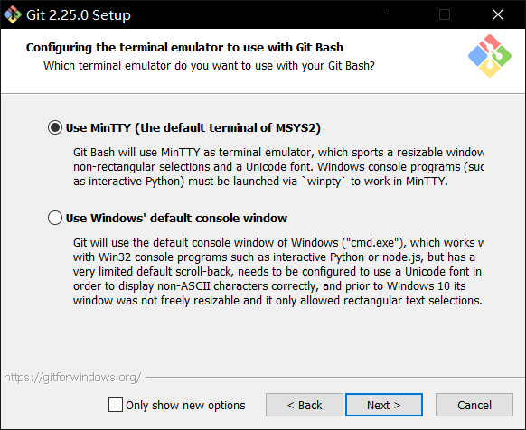
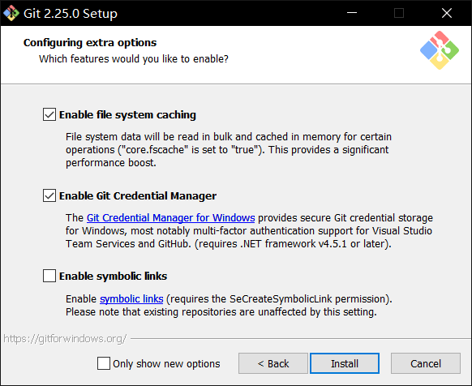
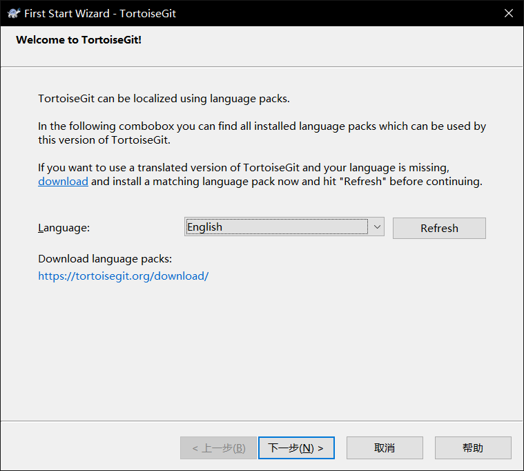
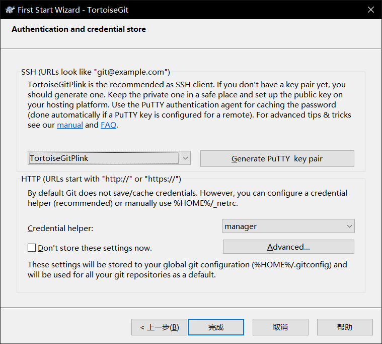
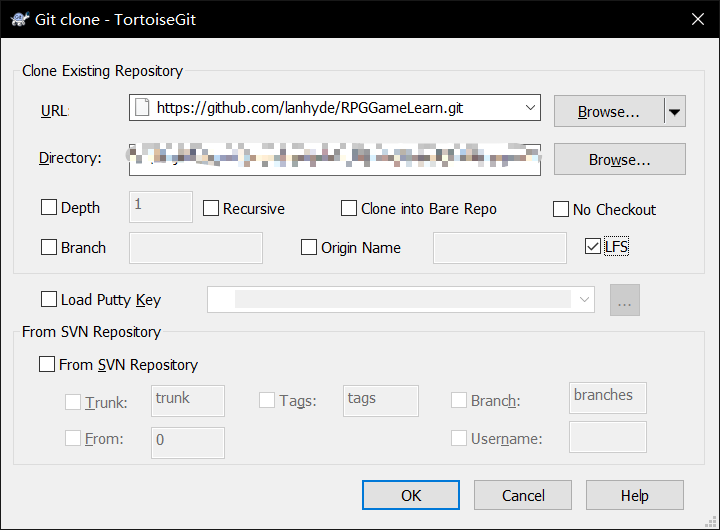

# 如何建立项目
## 安装git
1. 下载[git](https://git-scm.com/download/win)
2. 双击下载的exe文件，启动安装程序
3. 点击Next

	

4. 继续Next

	

5. 选择你习惯的编辑器，然后Next

	

6. 默认"Use Git from Git Bash only"，然后Next

	

7. 默认"Use the OpenSSL library"，然后Next

	

8. 默认"Checkout Windows-style, commit Unix-style endings"，然后Next

	

9. 默认"Use MinTTY"，然后Next

	

10. 保持默认选项，点击Install

	

11.等待安装完成

## 安装TortoiseGit(我以TortoiseGit为例进行说明，你可以选择任何你喜欢的git客户端)
1. 下载[TortoiseGit](https://tortoisegit.org/download/)
2. 双击下载的exe文件，启动安装程序
3. 和上面的安装过程类似，保持默认的安装选项，一路下一步，最后Install
   在选择安装选项时，建议全选。

	

4. 最后点击Finish完成
5. 完成后，进入TortoiseGit配置界面，点击下一步

	

6. 继续下一步

	

7. 配置git的路径。一般情况下Git.exe Path会自动填写git的安装路径。如果没有的话，请手动指定。

	

8. 填写你的名字和Email，然后下一步

	

9. 这里保持默认值，然后点击完成

	

## clone代码库到本地
1. 在本地创建一个目录（比如E:\RPGStudy\），然后进入目录
2. 点击鼠标右键，选择git clone...
3. 在弹出的Git clone对话框中，URL栏输入"https://github.com/lanhyde/RPGGameLearn.git",
   勾选LFS，然后点击OK

	

4. 等待代码库克隆完成，点击OK。

# To程序开发人员
## Visual Studio Code中推荐安装的插件
* C#
* Unity Code Snippets
* Debugger for Unity
* Unity DOTS Snippets (如果今后需要进行DOTS开发的话)

## Visual Studio Code的配置（建议，可以无视）
* 关闭Editor: Code Lens功能
* 开启Editor: Format On Paste

开发时请遵守以下规定：
1. 做的任何改动请通过pull request进行合并。
2. 对项目进行更改时，请创建并切换到新分支后进行开发作业。
3. 所有的pull request必须是合并到develop分支的，不允许发起合并到master分支的请求
4. pull request至少要有1个人review，并给与LGTM后才可以进行合并。原则上不允许任何
   无review的合并。如果有不得不合并的理由，请在slack的频道上留言，得到他人的LGTM
   后方可进行合并。
5. 发生conflict后，请Resolve后再合并。
6. 编码时请遵守命名规则的规定：函数名使用CamelCase格式命名，类成员使用camelCase格式
   命名。public static成员使用CAMEL_CASE格式命名。private static遵守camelCase格式。
7. 一个函数/方法的长度最长不要超过60行。如果特殊理由，请在注释中说明缘由。
8. 代码需要有适当的注释，这样别人改你的代码时不至于从何处下手。
9. 对代码/项目有任何疑问，请在github repository的issues中或者slack频道留言。
10. 对代码的位置有好的分类。比如：和Movement相关的代码移动到Movement目录下，和Inventory
   相关的代码放到Inventory目录下。共通部分放到Common目录下。
11. 原则上，代码中最好不要直接出现数字和字符串。如果需要，请定义相关类的Config类来管理
12. 对现有的代码有任何更好的实现方法，欢迎pull request。
13. 关于如何使用git/tortoisegit来管理代码，参见[这里](./version_control.md)

# To美工人员
1. 请使用正版的DD软件。可以考虑使用以下开源/免费软件代替：
* 3DS Max/Maya => blender
* Photoshop => Gimp
* Illustration => Inkscape
2. 素材放到项目的/design/目录下，根据素材的分类分别存放

# 项目中各目录的作用
 | 目录名 | 对哪些人员 | 目录内容 | 目录结构 |
 | ------ | ---------- | -------- | -------- |
 | Scripts |  开发人员  |   代码   | 命名空间/功能 |
 |  Game  |  设计人员  | Prefabs, ScriptableObjects | 实例单元 |
 | Scenes | 场景设计人员 | 场景，地形，NavMesh等 | 场景 |
 |   UI   | UI设计人员 | UI Prefabs | 界面 |
 | Asset Packs | - | 导入的资源 | 资源包 |
 | Audio | 音效设计人员 | 音频文件 | |
 | Models | 建模/动画人员 | FBX, meshes, 动画等 | |
