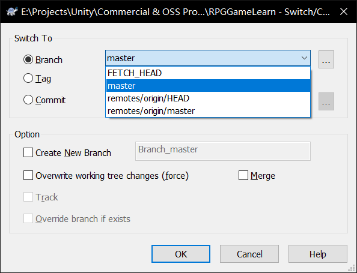
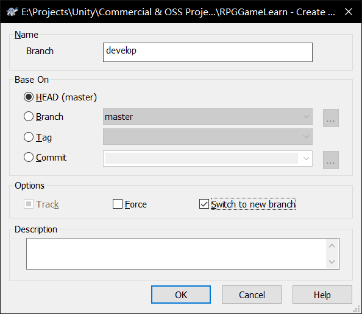
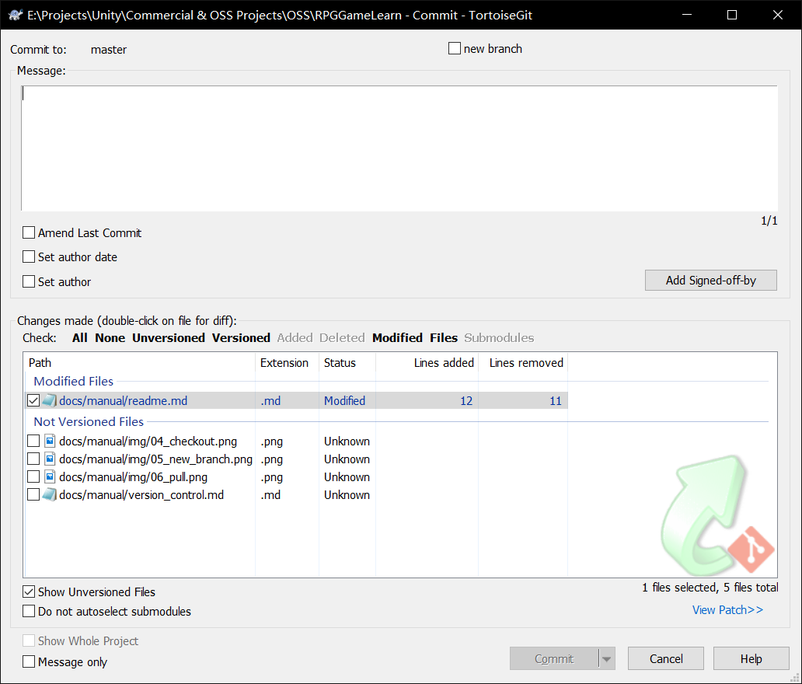

## 对版本管理不熟悉的人
  这里简要说明如何使用TortoiseGit进行版本管理。如果你是版本管理的大佬，请无视该教程。
### 如何切换分支？
1. 右键点击项目的根目录，或者在项目根目录下点击右键->TortoiseGit->Switch/Checkout...
2. 在Switch/Checkout对话框，选中Branch，然后选择需要切换的分支，点击OK进行切换。

	

### 如何创建新分支？
1. 右键点击项目的根目录，或者在项目根目录下点击右键->TortoiseGit->Create Branch...
2. 在Create Branch...对话框中，Branch填写新branch的名称，Base On选择作为基本分支的分支，
   如果需要立即切换到新分支，请勾选Switch to new branch.   

	

### 如何同步最新的代码库？
1. 右键点击项目的根目录，或者在项目根目录下点击右键->TortoiseGit->Pull...
2. 在弹出的Pull对话框中, Remote选择origin，Remote Branch选择你要同步的分支名称，
   这里一般都是使用默认设置，然后点击OK进行同步。

	

### 如何提交代码（到本地）？
1. 右键点击项目的根目录，或者在项目根目录下点击右键->【Git Commit 当前分支名称】...
2. 在commit对话框中，填写此次更改的message信息，选择要提交的文件（如果需要提交尚未）
   追踪的文件(Not Versioned Files)，请先把这些文件添加到待更新队列（Stash），具体方法为：
   右键点击在Not Versioned Files中的文件，然后选择Add。
3. 选择好后，点击Commit。

	

### 如何提交代码（到远程代码库）？
1. 右键点击项目的根目录，或者在项目根目录下点击右键->TortoiseGit->Push...
2. 在Push对话框，填写要提交的本地（Local)分支名称，以及要提交到远程库（Remote）
   的分支库名称。如果需要提交本地的全部分支，勾选Push all branches
3. 确认无误后，点击OK。

	

以上为TortoiseGit使用方法的最基础教程。如果想详细学习Git或者TortoiseGit的用法，
请自行搜索教程。